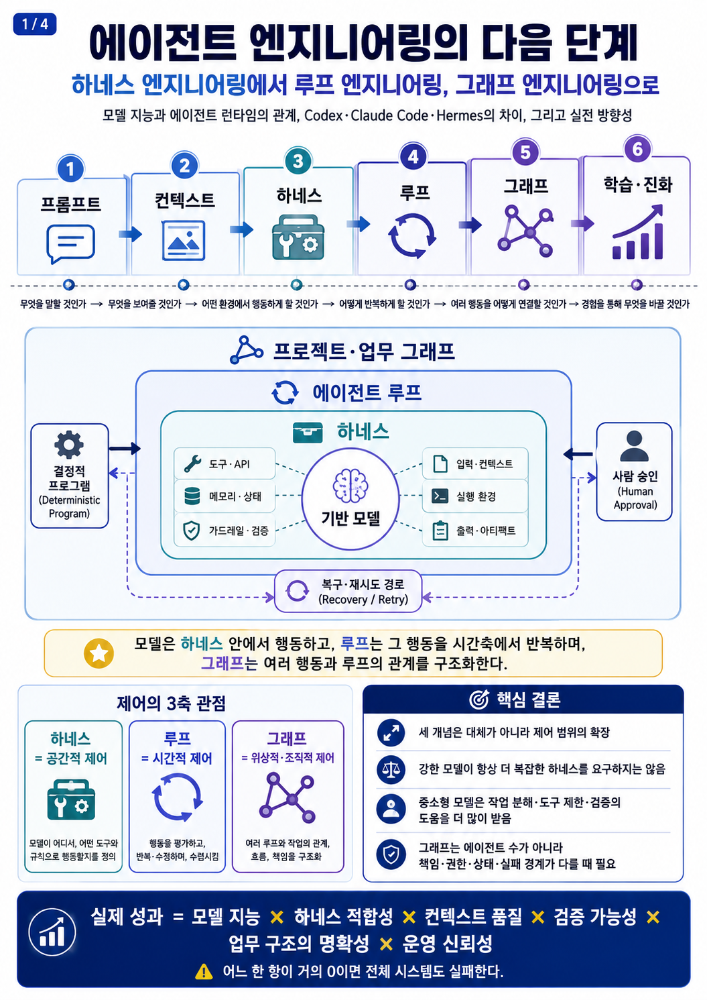
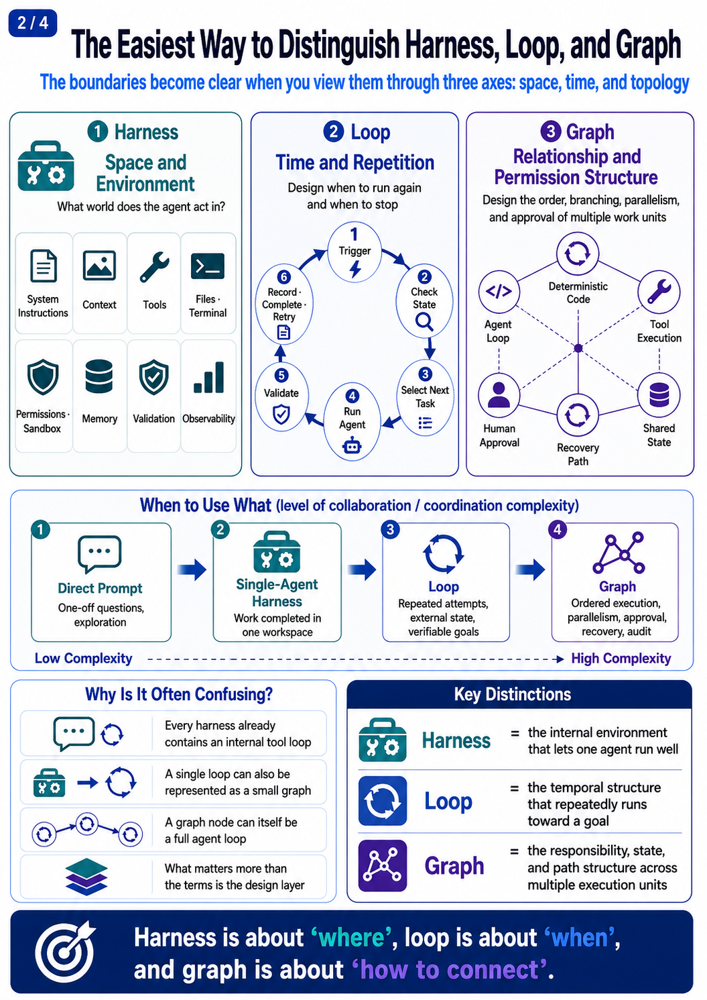
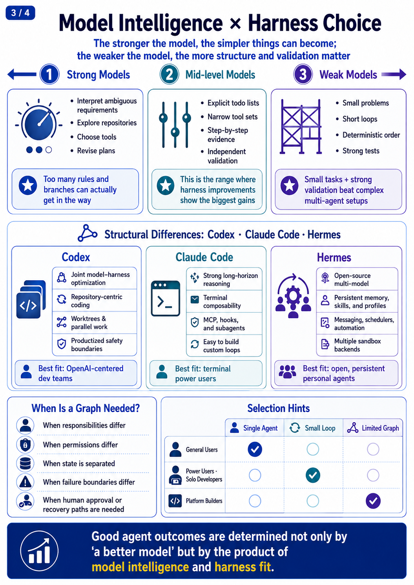
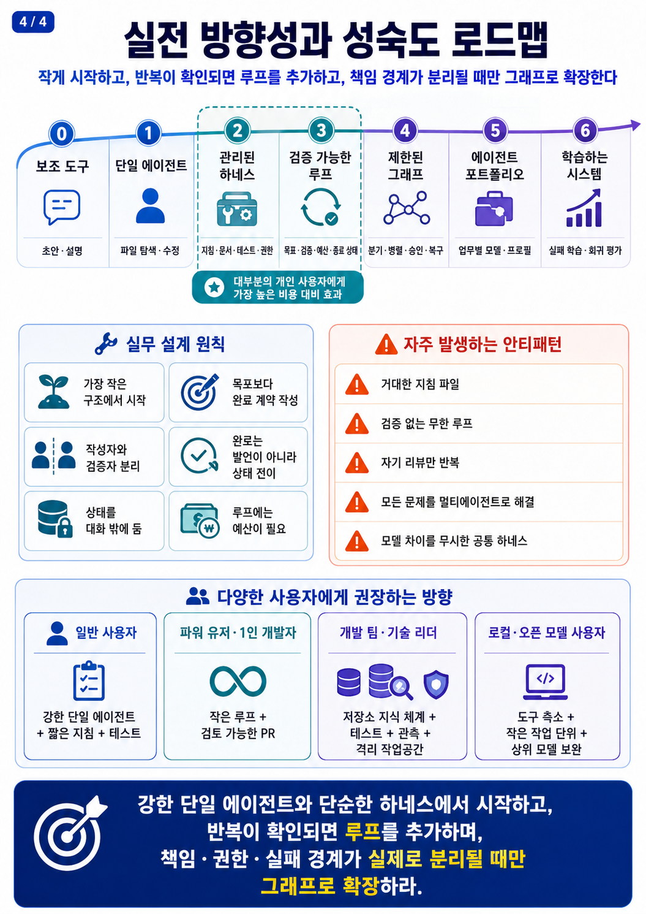
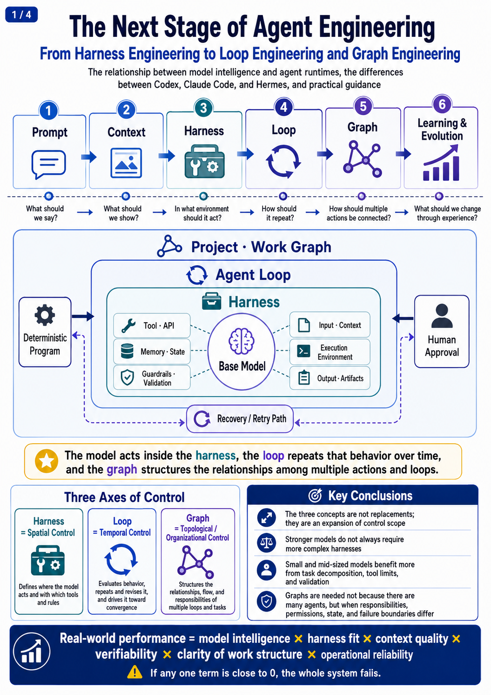

# 에이전트 엔지니어링의 다음 단계

> **하네스 엔지니어링에서 루프 엔지니어링, 그래프 엔지니어링으로**

모델은 하네스 안에서 행동하고, 루프는 그 행동을 반복하며, 그래프는 여러 루프와 사람·코드의 관계를 구조화한다. 자율성은 모델 지능보다 검증 가능성에 더 직접적으로 제한된다.

---

## 📖 한국어 버전

👉 [한국어 전체 문서 열기](https://pheanor-agent.github.io/agent-engineering-guide/)

---

## 📖 English Version

👉 [English Full Document](https://pheanor-agent.github.io/agent-engineering-guide/index-en.html)

---

*Agent Engineering Field Guide · 2026*
